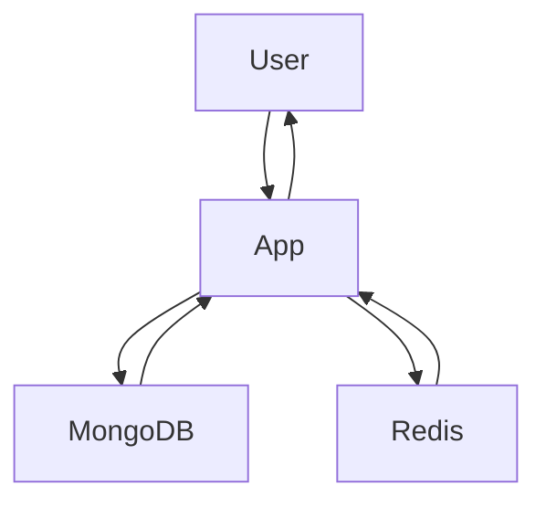

### user-manage-auth

- A Simple user management and authentication system in Python based on Flask Framework.
- This Application require MongoDB ( To persist User information ) and Redis ( To persist User Tokens )

### build directory
- To Build the user-manage-auth Image and spawn a container

### test directory 
- To run sample scenarios

### Current directory -
- **server**.py - contains the Flask Application
- **appconstants**.py - contains the Application Constants
- **mongo_db_connector**.py  - contains the code to connect to mongodb, create, update, delete, read Users
- **redis_cache**.py  - contains the code to cache Client Token in Redis
- **validate_param**.py  - contains the code to validate input paramters

**How to run user-manage-auth**
=============
### Prerequisites for Windows : 
- Docker Desktop 
- GIT Bash

### Steps to configure

`$ docker pull redis`

`$ docker pull mongo`

`$ docker run -d --name redis-container -p 6379:6379 redis`

`$ docker run -d --name mongo-container -p 27017:27017 mongo`

- Find the IP Address of the Docker Host, where the Docker containers are running.
`$ipconfig` [Run from Windows Command Prompt]

- This IP Address must be accessible from the application container, so that it can connect
   with MongoDB and Redis
  
- If IP Address is 192.168.0.105, this must be IP Address of Redis Server and MongoDB 
Server
- Basically, we run the Application, MongoDB, Redis container on the same Docker Host and hence
  Application must be able to connect to MongoDB and Redis container via the IP Address ( ex. 192.168.0.105 ]

`$ git clone git@github.com:srikrishvenkata/user-manage-auth.git`

`$ cd user-manage-auth`

`$ cd build`

- Open file named, **Dockerfile** 
- Goto Line 10, set ENV Variable value
- ENV MONGODB_HOST=192.168.0.105
- Goto Line 12, set ENV Variable value
- ENV REDIS_HOST=192.168.0.105

`$ chmod 755 build_spawn.sh`

`$ ./build_spawn.sh`

- Now this would build the Application image and Spawn a container.
- The Application is ready and can be accessed.

- To run a sample test
  
`$ cd ../test`

`$ chmod 755 run_test.sh`

`$ ./run_test.sh`

- Kindly press Enter after each output response.
- In case of any error / no response seen in GIT Bash, please check the logs of the Application Container

`$ docker logs user-mgmt-auth-container `

### Connectivity across Redis, MongoDB, Application

